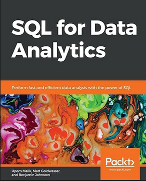
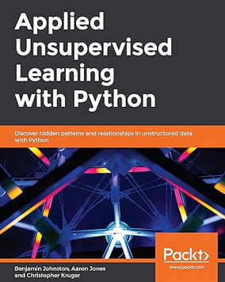
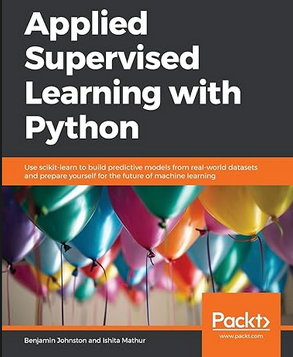
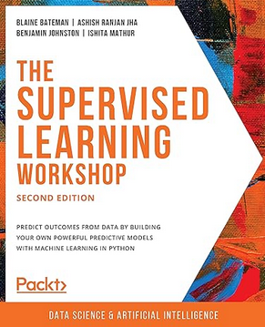

## Publications

- Johnston, B. Automated PAP mask sizing: a pathway for future mask designs, PhD thesis (2024) [https://hdl.handle.net/2123/32475](https://hdl.handle.net/2123/32475)
- Buchlak, Q.D., Tang, C.H.M., Seah, J.C.Y. et al. Effects of a comprehensive brain computed tomography deep learning model on radiologist detection accuracy. Eur Radiol 34, 810–822 (2024). [https://doi.org/10.1007/s00330-023-10074-8](https://doi.org/10.1007/s00330-023-10074-8)
- Johnston, B.; de Chazal, P. Deriving Ground Truth Labels for Regression Problems Using Annotator Precision. Appl. Sci. 2023, 13, 9130. [https://doi.org/10.3390/app13169130](https://doi.org/10.3390/app13169130) 
- B. Johnston and P. de Chazal, "A Method for Identifying Ground Truth Labels in Regression Problems using Annotator Precision," 2021 43rd Annual International Conference of the IEEE Engineering in Medicine & Biology Society (EMBC), Mexico, 2021, pp. 3181-3184, doi: [10.1109/EMBC46164.2021.9629710](https://doi.org/10.1109/EMBC46164.2021.9629710).
- B. Johnston and P. de Chazal, "Automatic Nasal PAP Mask Sizing with a Deep Unet," 2020 42nd Annual International Conference of the IEEE Engineering in Medicine & Biology Society (EMBC), Montreal, QC, Canada, 2020, pp. 6115-6118, doi: [10.1109/EMBC44109.2020.9176291](https://doi.org/10.1109/EMBC44109.2020.9176291).
- B. Johnston and P. d. Chazal, "The Effect of Landmark Variability on Automated PAP Mask Sizing," 2019 41st Annual International Conference of the IEEE Engineering in Medicine and Biology Society (EMBC), Berlin, Germany, 2019, pp. 4129-4132, doi: [10.1109/EMBC.2019.8856336](https://doi.org/10.1109/EMBC.2019.8856336)
- B. Johnston and P. de Chazal, "Automatic PAP Mask Sizing with an Error Correcting Autoencoder," 2019 41st Annual International Conference of the IEEE Engineering in Medicine and Biology Society (EMBC), Berlin, Germany, 2019, pp. 3677-3680, doi: [10.1109/EMBC.2019.8857317](https://doi.org/10.1109/EMBC.2019.8857317).
- Johnston, B., and P. de Chazal. "An automated system for sizing nasal PAP masks using facial photographs." JOURNAL OF SLEEP RESEARCH. Vol. 28. 111 RIVER ST, HOBOKEN 07030-5774, NJ USA: WILEY, 2019.
- Johnston, B., Chazal, P. A review of image-based automatic facial landmark identification techniques. J Image Video Proc. 2018, 86 (2018). [https://doi.org/10.1186/s13640-018-0324-4](https://doi.org/10.1186/s13640-018-0324-4)
- B. Johnston, A. McEwan and P. de Chazal, "Semi-automated nasal PAP mask sizing using facial photographs," 2017 39th Annual International Conference of the IEEE Engineering in Medicine and Biology Society (EMBC), Jeju, Korea (South), 2017, pp. 1214-1217, doi: [10.1109/EMBC.2017.8037049](https://doi.org/10.1109/EMBC.2017.8037049)
-B. Johnston, A. McEwan and P. de Chazal, "Semi-automated nasal PAP mask sizing using facial photographs," 2017 39th Annual International Conference of the IEEE Engineering in Medicine and Biology Society (EMBC), Jeju, Korea (South), 2017, pp. 1214-1217, doi: [10.1109/EMBC.2017.8037049.](https://doi.org/10.1109/EMBC.2017.8037049)
- De Chazal, Philip, Benjamin Johnston, and Alistair McEwan. "Semi-automated nasal PAP mask sizing using facial photographs." (2017).

## Books

[SQL For Data Analytics](https://www.packtpub.com/product/sql-for-data-analytics/9781789807356)

[Applied Unsupervised Learning with Python](https://www.packtpub.com/product/applied-unsupervised-learning-with-python/9781789952292)

[Applied Supervised Learning with Python](https://www.packtpub.com/product/applied-supervised-learning-with-python/9781789954920)

[The Supervised Learning Workshop](https://www.packtpub.com/product/the-supervised-learning-workshop-second-edition/9781800209046)

## Podcasts

## Patents
